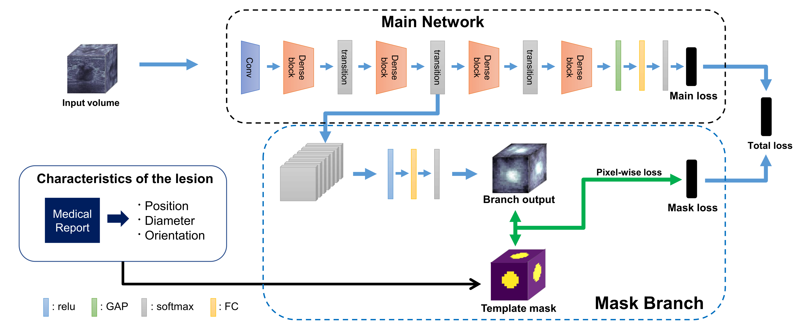
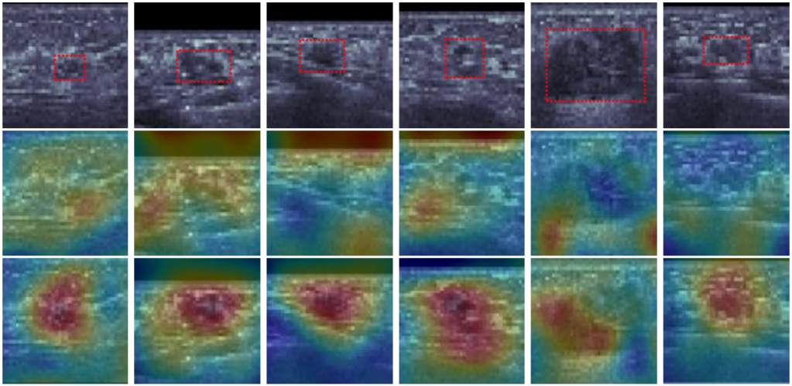

# Mask Branch Network
## _Weakly-supervised Branch Network with Template Mask for Detecting Masses in 3D Automated Breast Ultrasound_

This is a Tensorflow implementation of the "Mask Branch Network" architecture used for 3D medical imaging classification. This code only implements the Tensorflow graph, it must be used within a training program.

## Introduction
Mask Branch Network is a novel branch network architecture incorporating segmentation information of masses in the training process, which boosts the performance of existing neural network classifiers by providing spatial attention effect helping to learn meaningful features around the mass.   
The segmentation mask is created in a \emph{template} manner from the characteristics of breast masses already recorded in radiology reports without additional labeling efforts.  
Experimental results show that the proposed branch network with template mask significantly improves the performance of existing classifiers, and visualize the attention effect on target objects. 

Figure 1. The architecture of our proposed network:mask branch network

## Features
- 3D data processing ready
- Augmented patching technique, requires less image input for training
- Medical image pre-post processing
- Easy network replacement structure

## Usage
0. Install Tensorflow and required dependencies like cuDNN.
1. Clone this repo: `https://github.com/dkdkkim/maskbranchnetwork`
2. Set training & validation data on specific directory
3. Train as below
```sh
        python train.py
```
4. Test as below
```sh
        python test.py
```

## Quantitative result
The proposed networks with MBN outperforms the baselines in everyperformance measures, in both kinds of the main networks.

|  | Sensitivity | Specificity | AUC |
| ------ | ------ | ------ | ------ |
| DenseNet | 56.3% | 86.3% | 0.855 |
| DenseNet + MBN | 87.8% | 93.8% | 0.949 |
| ResNet | 65.0% | 70.0% | 0.768 |
| ResNet + MBN | 71.3% | 86.3% | 0.880 |


## Qualitative result

Class activation maps (CAMs) to show the effect of the mask branch network(MBN).Top row:Breast mass samples on ABUS images marked by red boxes.Middlerow:CAMs of DenseNet.Bottom row:CAMs of DenseNet with MBN

